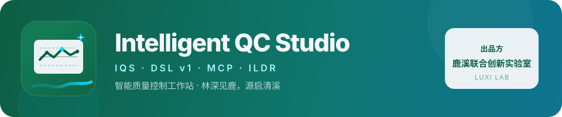
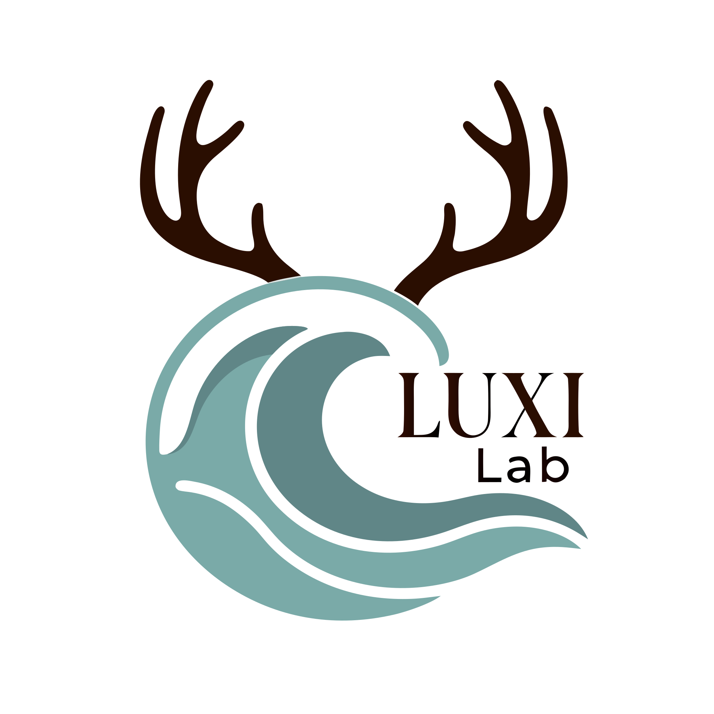

<p align="center">
  
</p>

<p align="center">
  
  &nbsp;&nbsp;&nbsp;
  
</p>

<h1 align="center">澄矩 · ChengJu（IQS）</h1>

<p align="center">
  <strong>澄矩 · 工业智能质量控制工作站</strong><br/>
  <em>源清流澈，行止应矩</em><br/>
  自研 <strong>IQS-DSL</strong> + AI 推理 + MCP 渲染 · 工业级 QC 图表平台
</p>

<p align="center">
  
  
  
  
  
  
  
</p>

<p align="center">
  <a href="#快速开始">快速开始</a> ·
  <a href="#核心能力">核心能力</a> ·
  <a href="#图种">图种</a> ·
  <a href="#iqs-flow-企业流程图">IQS-Flow</a> ·
  <a href="#ai-生成">AI 生成</a> ·
  <a href="#文档">文档</a> ·
  <a href="#知识产权与版权">版权</a>
</p>

---

## 产品标识

| | 标识 | 路径 |
|:---:|:---|:---|
| **产品** |  | [`public/brand/iqs-mark.svg`](./public/brand/iqs-mark.svg) · favicon：[`public/favicon.svg`](./public/favicon.svg) |
| **出品方** |  | [`public/brand/luxi-lab.svg`](./public/brand/luxi-lab.svg) |
| **横版字锁** |  | [`public/brand/iqs-logo.svg`](./public/brand/iqs-logo.svg) |

**色板（与见鹿 / 听默对齐）**

| 名称 | 色值 | 用途 |
|:---|:---|:---|
| 鹿溪绿 | `#0D5E42` | 产品标底、品牌主色 |
| 源启白 | `#F5F7FA` | 面板反白 |
| 进化蓝 | `#00D2FF` | 溪流、源启星、强调 |

**IQS 方标语义**：控制图折线 + 限线（QC/SPC）· S 形溪流（数据流动）· 源启星（智能生成）。

品牌说明：[`public/brand/README.md`](./public/brand/README.md)

---

## 项目简介

**澄矩 · ChengJu（Intelligent QC Studio / IQS）** 是面向质量管理（QC）小组活动与企业体系文件的 Web 工作站。用自研 **IQS-DSL** 把「自然语言 / 专业 DSL」变成可校验、可导出、可被 MCP 调用的图表；AI 只写 DSL，渲染在本地完成。

- 业务遵循 **T/CAQ 10201** 质量管理小组活动相关准则与 **PDCA** 图种覆盖
- **CORE（14）**：鱼骨、排列、直方、控制、散点、雷达、关联、矢线、PDPC、矩阵、图矩阵、亲和、基础图、**企业流程图（IQS-Flow）**
- **RELIEF**：Mermaid / VChart 类型外救济（**不替代** QC / 体系文件终稿）
- 出品标识：**鹿溪联合创新实验室** · 著作权人见文末
- 仓库：<https://github.com/itrilogy/smart-qc-studio>

---

## 核心能力

| 能力 | 说明 |
|:---|:---|
| **IQS-DSL v1.1** | 统一 Shell + Body；`dsl/kinds.json` 注册；`npm run validate:dsl` 门禁 |
| **双引擎 + 自研 SVG** | 统计图 ECharts；多数逻辑图 G6/Canvas；**Flow 自研正交 SVG**（零新依赖） |
| **AI 生成 DSL** | OpenAI 兼容（默认 DeepSeek）；`.env` 的 `API_KEY` 优先于 `public/config.js` |
| **MCP** | Stdio / SSE；瘦声明 + `protocol://` 资源；Puppeteer ILDR 无头出图 |
| **导出** | PNG / PDF；无头桥接 `captureIQSChart` |
| **回归** | `npm run test:flow` 覆盖解析 / SVG / BPMN / 主干序 / 格内序 |
| **发行材料** | [`docs/软著与发行/`](./docs/软著与发行/00_文档索引.md) |

### 架构一览

```text
┌─────────────────────────────────────────────────────────────┐
│  UI  Vite 6 · React 19 · Tailwind · LUXI LAB 侧栏编辑器      │
├─────────────────────────────────────────────────────────────┤
│  IQS-DSL v1  解析 · kinds 注册表 · lint / validate            │
├──────────────────┬──────────────────┬───────────────────────┤
│  统计图 ECharts  │  逻辑图 G6/Canvas │  Flow 自研 SVG         │
│  直方/控制/散点… │  鱼骨/亲和/PDPC…  │  泳道网格 + 正交走线   │
├──────────────────┴──────────────────┴───────────────────────┤
│  AI  aiService（.env → DeepSeek 等） · 导出 BaseDiagramRef    │
├─────────────────────────────────────────────────────────────┤
│  MCP  CORE/RELIEF · protocol://segments/… · Puppeteer ILDR   │
└─────────────────────────────────────────────────────────────┘
```

---

## 图种

### CORE（14）

| 场景 | kind | MCP |
|:---|:---|:---|
| 根因 / 5M1E | `fishbone` | `render_fishbone` |
| 关键少数 | `pareto` | `render_pareto` |
| 分布 / Cp·Cpk | `histogram` | `render_histogram` |
| SPC 稳定性 | `control` | `render_control` |
| 相关回归 | `scatter` | `render_scatter` |
| 多维对比 | `radar` | `render_radar` |
| 多重因果 | `relation` | `render_relation` |
| 关键路径 | `arrow` | `render_arrow` |
| 预案分支 | `pdpc` | `render_pdpc` |
| 多对多矩阵 | `matrix` | `render_matrix` |
| 多因子图矩阵 | `matrixPlot` | `render_matrix_plot` |
| KJ 亲和 | `affinity` | `render_affinity` |
| 柱线饼 | `basic` | `render_basic` |
| **跨部门审批 / 程序文件** | **`flow`** | **`render_flow`** |

### RELIEF

| 场景 | kind | 约束 |
|:---|:---|:---|
| 类型外结构 / 时序 | `mermaid` | 体系文件流程图终稿禁止用 `flowchart TD` 冒充 `flow` |
| 类型外复杂可视化 | `vchart` | 有 Native 等价时优先 Native |

完整语法 → [**IQS-DSL v1 手册**](./docs/IQS_DSL_V1_MANUAL.md) · 注册表 → [`dsl/kinds.json`](./dsl/kinds.json)

---

## IQS-Flow（企业流程图）

第 14 个 CORE kind。语义是 **BPMN 2.0 子集** + **字典-索引**：谁（泳道）× 做什么（活动）× 走哪条路（网关）。渲染为自研 SVG，不走 Mermaid。

```dsl
Title: 采购申请审批流程
Layout: H
Dict: D[信息中心,综合计划科,办公室]
Dict: P[申请阶段,审批阶段,执行阶段,归档阶段]
Lane from D[0,1,2] Layout H
Lane from P[0,1,2,3] Layout V
Attr active [Role,SOP,Lv,Time,KPI]
W: w1: 提交申请 Type[S] Location(D[0],P[0])
W: q1: 金额超过5000? Type[?] Location(D[0],P[1])
   是 → #w4
   否 → #w5
   End
```

| 能力 | 说明 |
|:---|:---|
| 字典展开 | 图上显示「信息中心」，不显示 `D[0]` |
| 正交走线 | 3×3 绘制格、WSAD 端口互斥、回边外侧走廊、T2 守护位移 |
| 配色方案 | 默认蓝 / 高反差 / 打印灰 / 青绿 / 暖沙，写入 `Color[Slot]` |
| 泳道线型 | `Grid: dashed`（默认）或 `Grid: solid`（内框与边界同一套） |
| 交叉辨识 | 线序更大的整条连线用连线色×底色的公共差异色 |
| 右下角标注 | 按 `Attr active` 顺序，只标该节点有值项 |
| 回归 | `npm run test:flow`（parser + SVG + BPMN + 主干序 + 格内序） |

手册：[USER_MANUAL_FLOW](./docs/USER_MANUAL_FLOW.md) · 规范：[IQS_FLOW_DSL_SPEC](./docs/IQS_FLOW_DSL_SPEC.md) · 协议：[protocol/segments/flow.md](./protocol/segments/flow.md)

---

## 快速开始

### 环境

- **Node.js 20+**（开发态断言脚本使用 22+ 的 `--experimental-strip-types`）
- Chrome / Edge 推荐
- （可选）Docker、大模型 API Key（DeepSeek 等 OpenAI 兼容接口）

### 开发模式

```bash
git clone https://github.com/itrilogy/smart-qc-studio.git
cd smart-qc-studio
npm install
cp .env.example .env          # 填写 API_KEY（勿提交）
npm run validate:dsl
npm run test:flow             # Flow 引擎回归
npm run dev                   # http://localhost:5173
```

若提示 `Port 5173 is in use`：用终端给出的备用端口，或结束旧 Vite 进程。

改 `.env` 后需**重启** `npm run dev`，Vite 才会把密钥注入前端。

### Docker

```bash
cp .env.example .env
docker compose up -d --build
```

| 端口 | 服务 |
|:---|:---|
| **5173** | Web 工作站 |
| **3000** | MCP SSE |

浏览器：<http://localhost:5173>  
入口脚本把 `API_KEY` / `AI_ACTIVE_PROFILE` 写入 `dist/config.js`，不要把真实密钥打进镜像层。

### MCP

需先有可访问的 Web 引擎（默认 `IQS_BASE_URL=http://localhost:5173`）。

```bash
npm run mcp:stdio       # 本地 AI 客户端
npm run mcp:sse         # http://localhost:3000/sse
```

| 资源 | 说明 |
|:---|:---|
| `protocol://dsl/v1` | 语言红线摘要 |
| `protocol://governance` | CORE / RELIEF |
| `protocol://segments/iqs_native/{kind}` | 单图完整语法 + 示例 |
| `protocol://segments/iqs_native/flow` | IQS-Flow 编译卡（外部模型写 Flow 必读） |

外部 LLM 画体系文件流程图应调用 **`render_flow`**，禁止用 Mermaid `flowchart TD` 充当终稿。

### 常用脚本

| 命令 | 说明 |
|:---|:---|
| `npm run dev` | 同步 MCP 清单 + Vite 开发服务器 |
| `npm run test:flow` | Flow 解析 / SVG / BPMN / 序 断言 |
| `npm run validate:dsl` | 语法手册 / MCP 覆盖校验 |
| `npm run build` | 校验 + Flow 断言 + 生产构建 |
| `npm run preview` | 预览构建产物 |
| `npm run sync-tools` | `mcp-server/mcp_tools.json` → `public/` |
| `npm run mcp:stdio` / `mcp:sse` | 启动 MCP |

---

## AI 生成

编辑器「AI 推理」把自然语言编成当前 kind 的 IQS-DSL，再交给本地解析器与渲染器。

```bash
# .env（已被 gitignore，勿提交真实密钥）
API_KEY=your-key
AI_ACTIVE_PROFILE=deepseek_public
```

| 项 | 说明 |
|:---|:---|
| 密钥来源 | **`.env` / Vite `process.env.API_KEY` 优先**，其次才是运行时 `window.APP_CONFIG` |
| 模型档案 | `public/config.json` → `deepseek_public`（`https://api.deepseek.com/v1/chat/completions` / `deepseek-chat`）或 `local_qwen` |
| 仓库占位 | `public/config.js` 的 `API_KEY` 必须留空；Docker 由 entrypoint 注入 |
| Flow 提示 | 已注入 `render_flow` 专家逻辑 + 语法 + 官方示例 + 禁止 Mermaid 红线 |

**不要把 API Key 写进 `public/config.js`、不要提交 `.env`。**

---

## 项目结构

```text
smart-qc-studio/
├── App.tsx / index.tsx              # 应用入口与编排
├── components/                      # *Diagram + *Editor
│   └── flow/                        # IQS-Flow：解析 / 布局 / 路由 / SVG / 编辑器
├── dsl/                             # kinds 注册表 · Shell · lint
├── services/aiService.ts            # AI 生成 DSL（.env 优先）
├── public/
│   ├── brand/                       # IQS + 鹿溪实验室标识
│   ├── config.json                  # AI profile（endpoint / model，无密钥）
│   ├── config.js                    # 运行时占位（API_KEY 留空）
│   └── mcp_tools.json               # 由 sync-tools 同步
├── mcp-server/                      # MCP 服务
├── protocol/                        # governance · DSL_V1 · segments
├── scripts/assert_flow_*.ts         # Flow 断言
├── docs/
│   ├── IQS_DSL_V1_MANUAL.md         # DSL 细粒度手册
│   ├── IQS_FLOW_DSL_SPEC.md         # Flow 规范
│   ├── USER_MANUAL_*.md             # 分图操作手册
│   └── 软著与发行/
├── Dockerfile · docker-compose.yml
└── package.json                     # 3.5.3-ildr · UNLICENSED
```

---

## 文档

| 文档 | 说明 |
|:---|:---|
| **[IQS-DSL v1 完整手册](./docs/IQS_DSL_V1_MANUAL.md)** | 14 个 CORE kind 指令表 / Body / 示例 / 反例 |
| [IQS-DSL 架构 SPEC](./docs/IQS_DSL_V1_SPEC.md) | 分层与权威序 |
| **[IQS-Flow 规范](./docs/IQS_FLOW_DSL_SPEC.md)** | 字典-索引、泳道、BPMN 子集、渲染规格 |
| [IQS-Flow 用户手册](./docs/USER_MANUAL_FLOW.md) | 30 秒出图、属性、走线、FAQ |
| [Flow 最优性框架](./docs/FLOW_OPTIMALITY_FRAMEWORK.md) | 布局/布线承诺分层（一般图不承诺全局最优） |
| [软著与发行 · 索引](./docs/软著与发行/00_文档索引.md) | 登记表、说明书、安装发行、检查清单 |
| [安装部署与发行指南](./docs/软著与发行/04_安装部署与发行指南.md) | 源码 / Docker / 验收 |
| [协议治理](./protocol/governance.md) | CORE / RELIEF |
| [Flow 协议切片](./protocol/segments/flow.md) | MCP / 外部模型编译卡 |
| [分图用户手册](./docs/) | `USER_MANUAL_*.md` |
| [CHANGELOG](./CHANGELOG.md) | 版本变更 |
| [COPYRIGHT](./COPYRIGHT.md) · [NOTICE](./NOTICE.md) | 版权与第三方 |

---

## 知识产权与版权

| 类型 | 内容 | 状态 |
|:---|:---|:---|
| 软著 ×2 | ① DSL 图表引擎 **V3.5** ② MCP 服务 **V2.7** | 材料见 `docs/软著与发行/` |
| 发明专利 ×2 | DSL 生成方法 · LLM 自纠正等 | 技术交底另册 |

**著作权人：江西省上饶市烟草专卖局（公司）**  
开发：信息中心 · 品牌协作标识：鹿溪联合创新实验室  

本软件为 **专有软件（Proprietary / UNLICENSED）**。未经书面授权，不得复制、分发或用于约定外用途。  
第三方开源组件见 [`NOTICE.md`](./NOTICE.md)。

---

## 贡献与支持

内部项目：需求与缺陷请通过单位既定流程反馈至 **信息中心 / IQS 项目组**。  
发行验收清单：[`docs/软著与发行/09_发行检查清单.md`](./docs/软著与发行/09_发行检查清单.md)。

---

<p align="center">
  
  &nbsp;
  
</p>

<p align="center">
  <sub>
    © 2026 江西省上饶市烟草专卖局（公司）信息中心<br/>
    澄矩 · ChengJu v3.5.3-ildr · 鹿溪联合创新实验室 · 源清流澈，行止应矩
  </sub>
</p>
