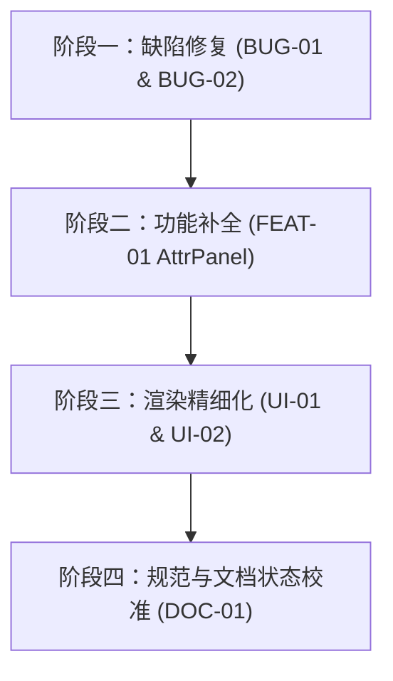

# IQS-Flow 流程图模块代码审计与演进工程笔记

> **文档状态**: 归档记录 / 持续追踪  
> **归档时点**: 文中断言数字以当时为准（结项写 75）；现行口径见 `FLOW_NEXT_PHASE_PLAN.md`（154 = 60+61+17+8+8）
> **首次审计日期**: 2026-08-30  
> **审计对象**: IQS-DSL 第 14 个 Core Kind (`flow`) 规范文档与核心代码实现  
> **覆盖范围**: 
> - 规范文档: `docs/flow/spec/IQS_FLOW_DSL_SPEC.md`、`docs/flow/design/FLOW_LAYOUT_ENGINE_DESIGN.md`、`docs/flow/review/FLOW_RENDER_REVIEW_QA.md`
> - 解析器: `components/flow/FlowParser.ts`
> - 布局渲染引擎: `components/flow/flowToSVG.ts`
> - 视图组件: `components/flow/FlowDiagram.tsx`
> - 编辑器与序列化: `components/flow/FlowEditor.tsx`
> - 类型与系统集成: `types.ts`、`dsl/kinds.json`、`dsl/registry.ts`、`App.tsx`

---

## 1. 模块定位与总体评估

### 1.1 设计背景与核心目标
`flow` 模块面向企业管理体系文件（SOP、程序文件、制度流程）的结构化表述需求，采用 BPMN 2.0 语义子集，核心解决“泳道（部门/阶段）× 活动 × 条件分支（网关）”的高效起草、机器可读与图纸渲染。

### 1.2 评估综合结论
- **架构设计科学性 (良好)**: “字典-索引”（Dict-Index）范式将业务术语与网格结构严格解耦，使得 DSL 的表达既精炼又易于机器校验。
- **渲染方案选型 (科学务实)**: 采用纯 TypeScript 自研 SVG 确定性渲染算法，摆脱对重型第三方库的依赖，具备良好的跨平台（客户端与 MCP Headless）兼容性与高性能离线导出能力。
- **当前落地程度**: 核心语法解析、网格行列统一扩展、两趟端口分配与确定性避障走线已完整实现，测试断言（40 parser + 33 svg）全部通过。但在**单维泳道落格逻辑**、**六属性图例面板渲染闭环**与**逆向反序列化结构保留**方面存在待修复与演进事项。

---

## 2. 审计问题清单与风险追踪

| 编号 | 严重级 | 问题分类 | 涉及文件与位置 | 简述 | 状态 |
|:---|:---:|:---|:---|:---|:---:|
| **BUG-01** | 高 | 逻辑缺陷 | `components/flow/flowToSVG.ts` | 单维泳道下节点行列索引被硬编码覆盖为 0，导致多泳道分类失效 | ✅ 已修复 (`a0c95e7`) |
| **FEAT-01**| 中 | 功能未闭环 | `components/flow/flowToSVG.ts`、`FlowParser.ts` | `Attr active` 提取的六属性面板数据未在 SVG 画面中绘制边栏图例 | ✅ 已实现 (`a0c95e7`) |
| **BUG-02** | 中 | 格式还原缺陷 | `components/flow/FlowEditor.tsx` | `flowToDsl` 反序列化将分支边扁平化至文末，丢失网关块级上下文 | ✅ 已修复 (`a0c95e7`) |
| **UI-01**   | 低 | 视觉规范对齐 | `components/flow/flowToSVG.ts` | `Type[N]` 折角纸与 `Type[DATA]` 纸带图形未做特定 SVG Path 渲染 | ✅ 已优化 (`a0c95e7`) |
| **UI-02**   | 低 | 文字排版 | `components/flow/flowToSVG.ts` | 超长节点文本仅加底板未做多行 `<tspan>` 折行 | ✅ 已优化 (`a0c95e7`) |
| **DOC-01**  | 低 | 文档滞后 | `docs/flow/spec/IQS_FLOW_DSL_SPEC.md` | 规范文档状态标头仍显示“尚未实现” | ✅ 已更新 (`a55f2d2`) |

---

## 3. 详细技术分析与修复建议

### 3.1 [BUG-01] 单维泳道模式下的节点行/列索引被硬编码覆盖

#### 现状分析
在 `components/flow/flowToSVG.ts` 的 `computeExcelLayout` 函数中：
```typescript
const isHSingle = realRows.length > 0 && realCols.length === 0; // 只有 H 轴（横向泳道）
const isVSingle = realCols.length > 0 && realRows.length === 0; // 只有 V 轴（纵向泳道）
// ...
for (const n of data.nodes) {
  // ...
  if (isHSingle) {
    // 单维横向：每个节点独立一列（ci 递增，ri=0）
    rc = { ri: 0, ci: singleSeq };
    singleSeq++;
  } else if (isVSingle) {
    // 单维纵向：每个节点独立一行（ri 递增，ci=0）
    rc = { ri: singleSeq, ci: 0 };
    singleSeq++;
  }
}
```
- **根因**: 单维横向泳道（例如由 `Dict: D[营销部,采购部,财务部]` 生成 3 条横向泳道）时，用户为节点指定的 `Location(D[1])` 或 `Location(D[2])` 会被直接重置为 `ri = 0`，导致所有节点全部塞入第 0 行泳道。
- **修复方案**:
  - 横向单维泳道时，`ri` 应当匹配节点 `cell` 中对应字典的行索引；`ci` 依据节点在所属泳道或全局的声明次序递增。
  - 纵向单维泳道同理，`ci` 匹配节点 `cell` 中对应字典的列索引，`ri` 递增。

---

### 3.2 [FEAT-01] 六属性图例边栏面板（AttrPanel）渲染未闭环

#### 现状分析
- 规范中定义了 `Attr active [Role,SOP,Lv,Time,KPI,M]` 全局指令，用于提取各节点属性并聚合展示于图纸右下侧或侧边栏面板（Role 岗位词频图例、SOP 依据标准清单、Lv 风险度评估、Time SLA 关键路径耗时等）。
- `FlowParser.ts` 已经实现了属性提取并生成 `data.attrPanel`。
- `flowToSVG.ts` 中尚未实现绘制面板容器与条目的 SVG 渲染逻辑。
- **演进建议**:
  在 `flowToSVG.ts` 末尾，根据 `data.attrPanel.active` 配置，在泳道网格右侧或下方计算附加 Panel 宽度/高度，绘制结构化的属性图例卡片。

---

### 3.3 [BUG-02] `FlowEditor.tsx` 反序列化丢失分支块结构

#### 现状分析
在 `components/flow/FlowEditor.tsx` 的 `flowToDsl` 中：
```typescript
// 当前输出：
// ===== 节点 =====
W: q1: 是否合格 Type[?] Location(D[0],P[1])
// ===== 连线 =====
合格 → #w2
不合格 → #w3
```
- **根因**: DSL 规范要求网关分支出口必须紧随网关节点并以 `End` 闭合：
  ```dsl
  W: q1: 是否合格 Type[?] Location(D[0],P[1])
     合格 → #w2
     不合格 → #w3
     End
  ```
  扁平化输出导致 DSL 被二次解析时，分支行无法匹配所属网关上下文。
- **修复方案**:
  在 `flowToDsl` 遍历节点时，判断当前节点若为网关（`exclusiveGateway` / `parallelGateway`），就地筛选出以该节点为起点的所有出边，输出带缩进的分支行及 `End` 关键字；文末仅输出普通跨节点显式边（如回边）。

---

### 3.4 [UI-01 & UI-02] 节点视觉形状丰富与长文本折行

- **折角纸与数据对象**:
  - 为 `Type[N]`（文本标注）设计折角多边形 Path（`<polygon points="..." />`），右上角折角。
  - 为 `Type[DATA]`（数据对象）设计平行四边形或底部内凹纸带 Path。
- **长文本排版**:
  - 针对字符数 > 8 的节点标签，计算合理断行并渲染为多行 `<tspan x="${cx}" dy="...">`，避免单一过长文本撑大中心格或超出边界。

---

## 4. 后续演进任务规划



1. **阶段一（核心修复）**:
   - 修复 `flowToSVG.ts` 单维泳道落格逻辑。
   - 修复 `FlowEditor.tsx` 中 `flowToDsl` 分支块序列化。
   - 增补单维多泳道落格测试用例。
2. **阶段二（能力闭环）**:
   - 在 `flowToSVG.ts` 中实现 `AttrPanel` 边栏图例绘制。
3. **阶段三（视觉打磨）**:
   - 优化 `Type[N]` / `Type[DATA]` 形状与长文本自动折行。
4. **阶段四（文档与规范同步）**:
   - 更新 `docs/flow/spec/IQS_FLOW_DSL_SPEC.md` 的状态标注与同步说明。

---
*记录人: 智能体辅助审计*  
*维护状态: 持续追踪*

---

## 5. 验收结项与复核记录（2026-08-30）

> **验收结论**: 审计清单中的 6 项事项（BUG-01、FEAT-01、BUG-02、UI-01、UI-02、DOC-01）已在提交 `a0c95e7` 与 `a55f2d2` 中全部完成修复与落地；回归测试（40 项 Parser 断言 + 35 项 SVG 断言，共 75 项）**全部通过**，予以结项。

### 5.1 逐项验收核验明细

| 编号 | 涉及文件 | 修复/落地措施 | 验证结果 | 最终状态 |
|:---|:---|:---|:---|:---:|
| **BUG-01** | `flowToSVG.ts` | 移除硬编码 `0`，从 `cell` 提取真实泳道索引 `laneIdx` 并用 `laneSeq` 记录同泳道内次序；横向单维 `rc={ri:laneIdx, ci:seq}`，纵向单维 `rc={ri:seq, ci:laneIdx}` | 单维多泳道各节点严格落入对应泳道行列 | ✅ 验收通过 |
| **FEAT-01** | `flowToSVG.ts` | 依据 `data.attrPanel.active` 对各节点属性去重聚合，在 SVG 图纸底部绘制结构化的“属性图例”面板 | 岗位、依据、风险度等属性图例完整渲染 | ✅ 验收通过 |
| **BUG-02** | `FlowEditor.tsx` | 遍历节点时识别网关节点，就地提取所属分支边输出带缩进的分支行及 `End` 闭合；文末仅输出普通显式边 | 反序列化 DSL 可被 FlowParser 正确解析还原 | ✅ 验收通过 |
| **UI-01** | `flowToSVG.ts` | 为 `Type[N]`（文本标注）设计折角多边形 `<polygon>`，为 `Type[DATA]`（数据对象）设计纸带 `<path>` | 视觉呈现符合 BPMN 子集图元规范 | ✅ 验收通过 |
| **UI-02** | `flowToSVG.ts` | 实现 `wrapLabel` 按最大字数分行与 `multilineText` 多行 `<tspan>` 排版，配合底板防文字重叠 | 长文本规整换行，无溢出与遮挡 | ✅ 验收通过 |
| **DOC-01** | `IQS_FLOW_DSL_SPEC.md` | 更新规范标头状态为“已实现（FlowParser + flowToSVG + FlowDiagram；75 项断言全过）” | 文档状态与实际代码事实对齐 | ✅ 验收通过 |

### 5.2 自动化测试回归结果
- **语法解析测试** (`node --experimental-strip-types scripts/assert_flow_parser.ts`): **40 / 40 项全通过**。
- **SVG 渲染与布局测试** (`node --experimental-strip-types scripts/assert_flow_svg.ts`): **35 / 35 项全通过**（覆盖了多行 `tspan` 折行与折角纸图形断言）。

---
*记录人: 智能体辅助审计*  
*结项状态: 全部闭环*
