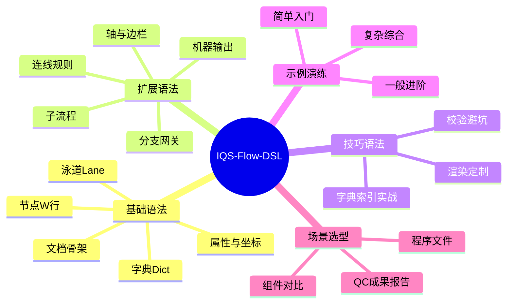

# IQS-Flow DSL 语法指南 · 导航总览

> 一套面向企业流程建模的**字典-索引式流程图 DSL**：用 30 秒可上手的文本语法，回答流程三问——**谁（泳道）× 做什么（活动）× 什么条件下走哪条路（网关）**。

---

## 这是什么

IQS-Flow DSL 是 Smart QC Studio（IQS）第 14 个 core kind（`flow`）的领域语言，语义定界为 **BPMN 2.0 子集**，渲染为**自研 SVG**（零新增第三方依赖）。它面向信息中心日常管理的 **665 个体系文件**中大量程序文件（CX）的流程图起草与全生命周期重构。

**核心范式**：数据与结构分离——所有可变内容（部门/阶段/岗位/节点标签/属性值）集中在 `Dict` 字典数组定义，结构层（`Lane`/`W`/连线）只写**索引引用**。一处定义、多处引用、修改全局生效。

## 学习路线图

## 板块速查表

| 板块 | 笔记 | 你能学到 |
|:---|:---|:---|
| 基础语法 | [[01-基础语法-文档骨架与词法约定]] | 文档结构、注释、标点、依赖顺序 |
| 基础语法 | [[02-基础语法-字典层Dict与索引引用]] | 数据层：D/P/R 字典、索引引用三形态 |
| 基础语法 | [[03-基础语法-泳道Lane与网格模型]] | 结构层：泳道声明、三种形态、网格坐标 |
| 基础语法 | [[04-基础语法-节点W行与八种类型]] | 活动：W 行语法、Type 类型表 |
| 基础语法 | [[05-基础语法-属性六元组与坐标定位]] | 属性：SOP/Role/Lv/Time/KPI/M、Location |
| 扩展语法 | [[06-扩展语法-连线与默认顺序流]] | 默认连边、显式边、回边与断点规则 |
| 扩展语法 | [[07-扩展语法-分支网关与End闭合]] | 判断/并行出口、条件、否则默认出口 |
| 扩展语法 | [[08-扩展语法-子流程与合并收敛]] | Type[SUB] 内嵌子图、多目标扇出、隐式合并 |
| 扩展语法 | [[09-扩展语法-轴标题与属性边栏]] | AxisX/Y、整图标题、Attr active 聚合边栏 |
| 扩展语法 | [[10-扩展语法-机器输出canonical与BPMN]] | 三层机器输出：JSON / XML / SVG |
| 技巧语法 | [[11-技巧语法-字典索引范式实战]] | 一处定义多处引用、字面量与字典抉择、维度清洗 |
| 技巧语法 | [[12-技巧语法-校验规则与常见避坑]] | 18 条内置校验、高频报错与反例 |
| 技巧语法 | [[13-技巧语法-渲染布局与视觉定制]] | 网格撑开、走线通道、图例栏、颜色槽 |
| 示例 | [[14-示例-简单入门最小流程图]] | 无泳道最小可用流程 |
| 示例 | [[15-示例-一般进阶单维泳道质检流程]] | 单维泳道 + 分支 + 子流程 |
| 示例 | [[16-示例-复杂综合二维矩阵审批流程]] | 二维矩阵 + 属性边栏 + 回边 + 图例 |
| 场景 | [[17-场景-使用场景与组件选型]] | 何时用 flow，何时用 pdpc/arrow/mermaid |

## 三种阅读路径

### 路径 A：零基础快速上手（约 30 分钟）
01 → 02 → 03 → 04 → 05 → 14（动手跑通第一个图）→ 06 → 07 → 15 → 08 → 16

### 路径 B：按需速查（遇到问题直接查）
- 想画判断分支 → [[07-扩展语法-分支网关与End闭合]]
- 报错看不懂 → [[12-技巧语法-校验规则与常见避坑]]
- 属性怎么标 → [[05-基础语法-属性六元组与坐标定位]]
- 泳道怎么排 → [[03-基础语法-泳道Lane与网格模型]]
- 图不整齐 → [[13-技巧语法-渲染布局与视觉定制]]

### 路径 C：深度研究者（理解设计哲学）
02 → 11（字典-索引范式）→ 10（机器输出）→ 13（渲染工程）→ 17（场景选型）

---

## 关联阅读

- 全局语法体系 → [[01-基础语法-文档骨架与词法约定]]
- 本指南的规范源头：工程代码 `docs/IQS_FLOW_DSL_SPEC.md`（v0.7.0）与 `docs/USER_MANUAL_FLOW.md`
- 上层入口 → [[_知识图谱总览]]

---

> 下一步：从 [[01-基础语法-文档骨架与词法约定]] 开始
