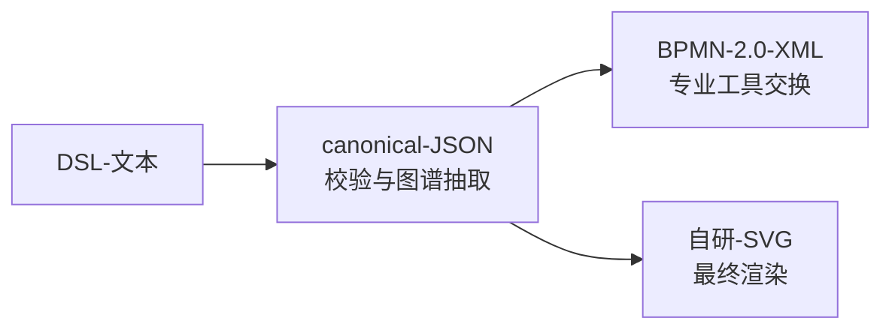

# 基础语法 · 文档骨架与词法约定

> IQS-Flow DSL 文档是一份**按区段组织的文本**：头区（Title/Layout）→ 数据区（Dict）→ 结构区（Lane/Axis）→ 节点区（W）→ 连线区（edge），每一行都有明确职责。

---

## 1. 文档结构（BNF 总览）

一份 flow 文档的结构可以用下面的文法概括：

```text
flowDoc  := header* dict+ lane* axis* attrPanel* node* edge*
header   := "Title:" str | "Layout:" ("H"|"V")
dict     := "Dict:" name "[" value ("," value)* "]"
lane     := "Lane from" dictRef "Layout" ("H"|"V")
axis     := "AxisX:" str "Align" ("L"|"R"|"C")
          | "AxisY:" str "Align" ("L"|"R"|"C")
          | "Axis:" str ("AxisX"|"AxisY") ["Align" ("L"|"R"|"C")]
attrPanel:= "Attr active" ["[" key ("," key)* "]"]
node     := "W:" [id ":"] label [typeMark] [location] attr*
edge     := id "→" "#" id [label]
blockEnd := "End"
```

> [!tip] 记忆口诀
> **头 → 数 → 构 → 点 → 线**：先声明标题布局，再定义字典数据，然后画泳道与轴，接着逐行写节点，最后补显式连线。读文档的顺序就是写的顺序。

## 2. 词法约定（最容易踩坑处）

| 规则 | 说明 | 示例 |
|:---|:---|:---|
| 行注释 | `//`，沿用 IQS-DSL v1 全局约定 | `// 这是注释` |
| `#` 字符 | **仅用于节点引用**（`#w1`），不作注释、不作层级 | `是 → #w4` |
| 结构分隔符 | Dict 数组内、Location 坐标内、分支多目标内用**半角逗号** `,` | `D[0,1,2]` |
| 内容标点 | 标签/字典值内文字标点用**中文全角**（`，` `；` `：`），避免与结构分隔符冲突 | `Dict: D[信息中心，综合计划科]` 中不应写半角逗号 |
| 大小写 | 关键字 `Type`/`Location`/`Layout`/`Align`/`End`/`Dict`/`Lane` **大小写不敏感** | `type[S]` 与 `Type[S]` 等价 |
| 字典名 | **区分大小写** | `worker` 与 `Worker` 是两个字典 |

> [!warning] 半角逗号是结构符
> 在字典值内部需要写逗号时必须用全角 `，`，否则解析器会把一个值拆成两个。例如部门名"信息中心，综合计划科"应写成 `Dict: D[信息中心，综合计划科]` 的**全角**形式。

## 3. 依赖顺序（强制）

`Dict` 定义**必须先于** `Lane from` / `W` / `Location` 中的引用：

```dsl
// ✅ 正确：先定义字典，再引用
Dict: D[信息中心,综合计划科]
Lane from D[0,1] Layout H

// ❌ 错误：引用未定义的字典
Lane from D[0,1] Layout H
Dict: D[信息中心,综合计划科]
```

解析器对未定义字典直接报错（error 级，见 [[12-技巧语法-校验规则与常见避坑]]）。

## 4. 三层机器输出（理解全链路）

DSL 文本不是终点，而是链条起点：



1. **DSL**：人写的宽松文本（节点 id 可省略、坐标可缺省）
2. **canonical JSON**：解析器归一化后的严格结构（id 自动编号、默认边全部展开），可审计、可校验
3. **BPMN 2.0 XML**：与专业 BPMN 工具交换的桥梁
4. **自研 SVG**：零第三方依赖的最终渲染

> [!note] 理解价值
> 明白这条链路，就能理解"为什么语法这么宽松也能保证机器可读"——宽松是给人写的，严格是给机器看的，中间由解析器归一。

---

## 关联阅读

- 数据从哪来 → [[02-基础语法-字典层Dict与索引引用]]
- 结构怎么搭 → [[03-基础语法-泳道Lane与网格模型]]
- 节点怎么写 → [[04-基础语法-节点W行与八种类型]]
- 机器端如何归一 → [[10-扩展语法-机器输出canonical与BPMN]]
- 返回导航 → [[00-导航总览]]

---

> 下一步：[[02-基础语法-字典层Dict与索引引用]]
